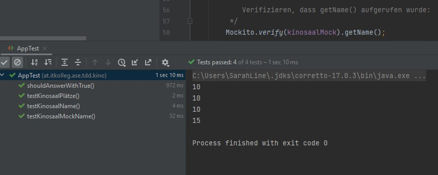
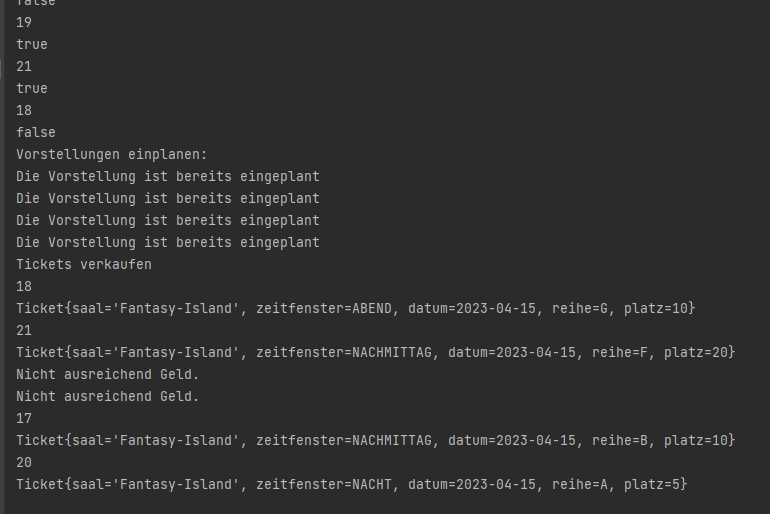
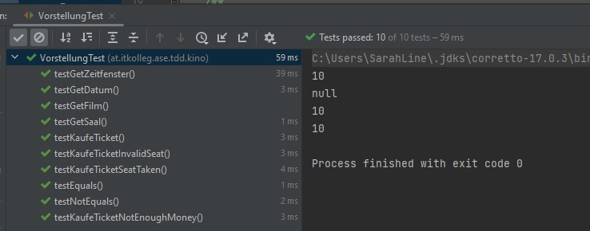
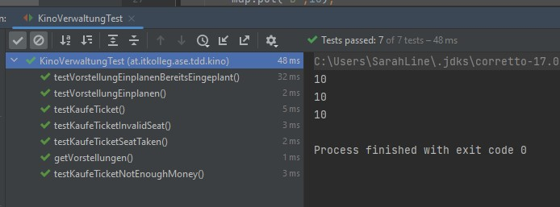
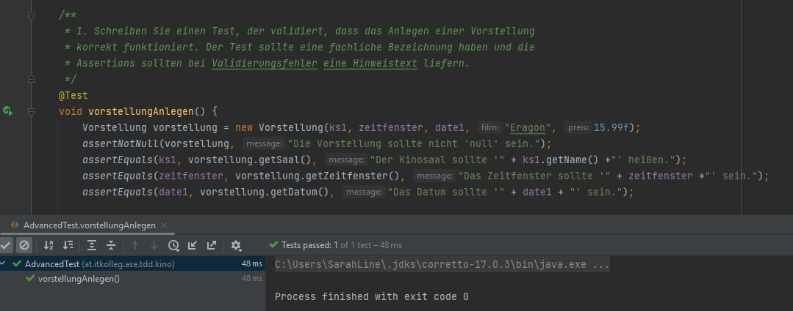
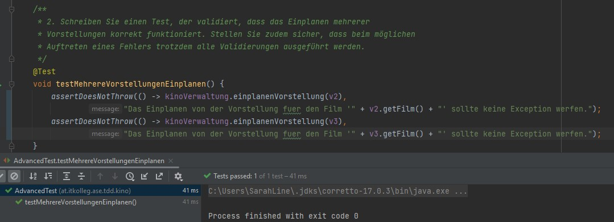
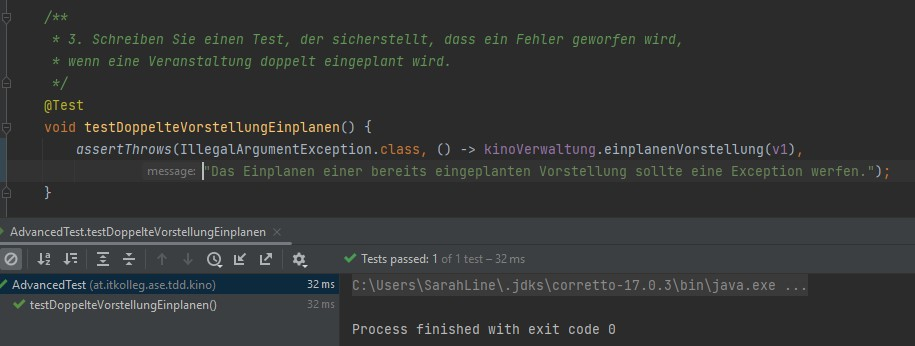
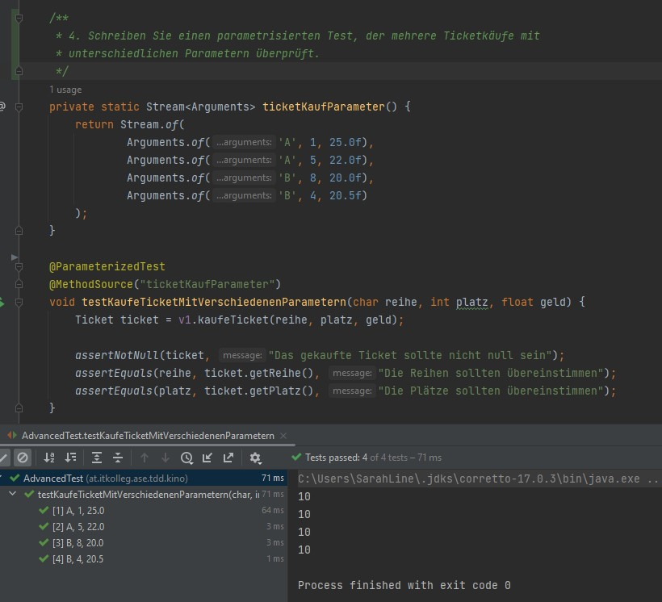
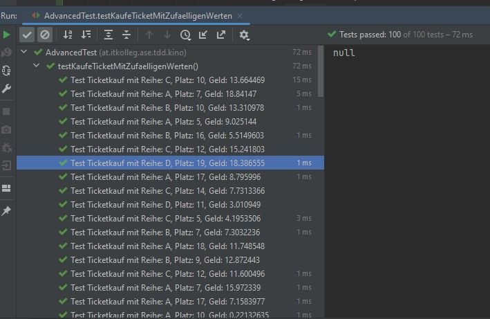

# FSE_Landerer_TDD

## AUFGABE 1: THEORIE

### Testdriven Development
Test Driven Development (TDD) ist eine Entwicklungspraktik, bei der Tests geschrieben werden, bevor der eigentliche Code geschrieben wird. Der Prozess besteht aus drei Schritten:

- Schreiben eines Tests: Zuerst wird ein Test geschrieben, der beschreibt, was das Programm tun soll. Dieser Test sollte fehlschlagen, da der Code, der das Verhalten implementiert, noch nicht geschrieben wurde.

- Schreiben des Codes: Als nächstes wird der Code geschrieben, der den Test bestehen lässt. Dieser Code sollte so einfach wie möglich sein und nur das nötigste tun, um den Test zu bestehen.

- Refactoring: Nachdem der Test erfolgreich bestanden wurde, wird der Code überarbeitet, um sicherzustellen, dass er lesbar, effizient und wartbar ist. Dann wird der Prozess mit einem neuen Test wiederholt.

Dieser iterative Prozess soll sicherstellen, dass der Code zuverlässig funktioniert und dass erwartete Ergebnisse produziert. Es kann auch dazu beitragen, Fehler frühzeitig zu entdecken und Zeit und Kosten zu sparen, da Fehler frühzeitig im Entwicklungsprozess gefunden und behoben werden können.

### Red-Green-Refactor
Red-Green-Refactor ist ein zentraler Teil des Test Driven Development (TDD) Prozesses und beschreibt die drei Schritte, die während der Entwicklung durchlaufen werden:

- Red: Im ersten Schritt schreibt man einen Test, der beschreibt, welche Funktion das Programm erfüllen soll. Da noch kein Code geschrieben wurde, der diese Funktion erfüllt, wird der Test fehlschlagen und "rot" sein.

- Green: Im zweiten Schritt schreibt man Code, um den Test zu bestehen, sodass der Test "grün" wird. Der Code sollte so einfach wie möglich sein, um nur die geforderte Funktion auszuführen.

- Refactor: Im dritten Schritt wird der Code verbessert, um sicherzustellen, dass er lesbar, wartbar und effizient ist, ohne dass der Test fehlschlägt. Dies wird als "Refactoring" bezeichnet.

Der Prozess wird wiederholt, indem man einen weiteren Test schreibt, der beschreibt, welche Funktion das Programm als nächstes erfüllen soll, und dann wieder durch die drei Schritte Red-Green-Refactor geht. Dieser iterative Prozess soll sicherstellen, dass der Code zuverlässig funktioniert und dass erwartete Ergebnisse produziert. Es kann auch dazu beitragen, Fehler frühzeitig zu entdecken und Zeit und Kosten zu sparen, da Fehler frühzeitig im Entwicklungsprozess gefunden und behoben werden können.

### FIRST-Acronym
FIRST ist ein Akronym, das oft im Kontext von Test-Driven Development (TDD) und Agile-Softwareentwicklung verwendet wird. Es steht für:

- Fast: Tests sollten schnell ausgeführt werden können, um den Entwicklungsprozess zu beschleunigen.

- Isolated: Tests sollten unabhängig von anderen Tests ausgeführt werden können, um sicherzustellen, dass Fehler leicht identifiziert und behoben werden können.

- Repeatable: Tests sollten in der Lage sein, wiederholt ausgeführt zu werden, um sicherzustellen, dass sie konsistente Ergebnisse liefern.

- Self-Verifying: Tests sollten selbst überprüfen können, ob sie erfolgreich sind oder fehlgeschlagen sind, ohne menschliche Intervention.

- Timely: Tests sollten rechtzeitig geschrieben werden, bevor der Code geschrieben wird, um sicherzustellen, dass der Code zuverlässig funktioniert und erwartete Ergebnisse produziert.

Diese Prinzipien sollen sicherstellen, dass die Tests effektiv sind und einen Beitrag zur Erstellung von zuverlässigem Code leisten. Wenn Tests diese Prinzipien erfüllen, können sie schnell ausgeführt werden, Fehler leicht identifiziert werden, der Entwicklungsprozess beschleunigt werden und zuverlässiger Code produziert werden.

### Kent Beck (welche Rolle spielt er in Bezug auf TDD)
Kent Beck ist ein bekannter Softwareentwickler und Autor, der eine wichtige Rolle bei der Entwicklung von Test Driven Development (TDD) gespielt hat.

Beck gilt als Begründer von TDD, da er in den späten 1990er Jahren begann, diese Technik zu praktizieren und darüber zu schreiben. Er hat zahlreiche Bücher über Softwareentwicklung geschrieben, darunter "Test Driven Development: By Example", das als ein Standardwerk in der Branche gilt.

Beck ist auch bekannt für seine Arbeit an der Extreme Programming (XP) Methode, einer agilen Entwicklungsmethode, die eng mit TDD verbunden ist. XP setzt stark auf TDD, um zu gewährleisten, dass der Code zuverlässig funktioniert und dass erwartete Ergebnisse produziert werden.

Beck hat sich auch als Vordenker im Bereich des Software-Designs etabliert und hat die Prinzipien von Einfachheit, Kommunikation und Feedback in der Softwareentwicklung betont. Er hat zahlreiche Auszeichnungen und Ehrungen für seine Arbeit erhalten und bleibt einflussreich in der Branche.

### Testarten

#### Unit-Tests (Sociable, Solitary, Mocks)
Unit-Tests sind eine Art von Tests, die auf einzelne Einheiten des Codes, wie z.B. Funktionen oder Methoden, angewendet werden. Es gibt verschiedene Arten von Unit-Tests, die je nach ihrem Zweck und ihrem Kontext unterschieden werden können, darunter sociable, solitary und Mock-Tests.

- Sociable Tests: Sociable Tests (auch bekannt als "Integrationstests") testen die Interaktion zwischen verschiedenen Komponenten des Systems. Diese Tests können mehrere Einheiten des Codes oder sogar mehrere Systeme umfassen und testen, ob sie korrekt zusammenarbeiten. Sociable Tests eignen sich besonders für Systeme, die aus mehreren Komponenten oder Diensten bestehen.

- Solitary Tests: Solitary Tests (auch bekannt als "Unit-Tests" oder "Isolationstests") testen einzelne Einheiten des Codes isoliert voneinander. Diese Tests überprüfen, ob die Funktion oder Methode, die getestet wird, in sich geschlossen und fehlerfrei ist. Solitary Tests eignen sich besonders für einfache Funktionen oder Methoden, die keine komplexen Interaktionen mit anderen Teilen des Systems aufweisen.

- Mock-Tests: Mock-Tests sind Tests, die verwendet werden, um die Interaktionen zwischen verschiedenen Teilen des Systems zu simulieren. Sie werden oft verwendet, um Komponenten zu testen, die auf externe Dienste oder Datenquellen zugreifen, wie z.B. Datenbanken oder APIs. Durch den Einsatz von Mock-Tests können Entwickler sicherstellen, dass die Einheiten des Codes korrekt auf externe Dienste zugreifen und auf unerwartete Bedingungen reagieren.

#### Integrationstests
Integrationstests sind Tests, die dazu dienen, das Zusammenspiel von verschiedenen Komponenten eines Systems zu testen. Im Gegensatz zu Unit-Tests, die einzelne Einheiten des Codes isoliert testen, testen Integrationstests die Interaktionen zwischen verschiedenen Komponenten des Systems.

Integrationstests können auf verschiedenen Ebenen des Systems durchgeführt werden, von der Integration von Komponenten innerhalb eines Moduls oder einer Anwendung bis hin zur Integration von mehreren Anwendungen oder Systemen. Sie können auch auf verschiedenen Ebenen der Integrationsebenen durchgeführt werden, von der Integration von Code auf der lokalen Entwicklungsplattform bis hin zur Integration auf einer Testumgebung, die der Produktion ähnelt.

Integrationstests können auf unterschiedliche Weise durchgeführt werden. Manuelle Tests, bei denen Testszenarien manuell ausgeführt werden, sind eine Möglichkeit, Integrationstests durchzuführen. Automatisierte Tests, bei denen Integrationstests automatisiert durchgeführt werden, sind jedoch die bevorzugte Methode. Automatisierte Integrationstests können mit verschiedenen Tools und Frameworks durchgeführt werden, einschließlich spezialisierter Integrationstest-Frameworks und Testautomatisierungs-Tools.

Integrationstests sind ein wichtiger Bestandteil des Testprozesses, da sie dazu beitragen, sicherzustellen, dass die verschiedenen Komponenten des Systems ordnungsgemäß zusammenarbeiten und dass das System als Ganzes zuverlässig und fehlerfrei ist. Durch Integrationstests können Probleme wie Integrationsschwierigkeiten, Inkompatibilitäten zwischen verschiedenen Komponenten oder Fehlfunktionen bei der Datenübertragung oder -verarbeitung entdeckt und behoben werden, bevor das System in die Produktion geht.

#### UI-Tests / End-To-End Tests / Systemtests
UI-Tests, End-to-End-Tests und Systemtests sind alle Arten von Tests, die darauf abzielen, das gesamte System in seiner Gesamtheit zu testen.

- UI-Tests: UI-Tests testen die Benutzeroberfläche (UI) des Systems. Sie testen, ob die UI korrekt funktioniert und ob die Benutzeraktionen die erwarteten Ergebnisse liefern. UI-Tests können entweder manuell oder automatisiert durchgeführt werden und erfordern typischerweise eine Testumgebung, die der tatsächlichen Produktionsumgebung so nahe wie möglich kommt.

- End-to-End-Tests: End-to-End-Tests testen das gesamte System vom Start bis zum Ende und simulieren typischerweise eine reale Nutzungssituation. Sie prüfen, ob alle Systemkomponenten und Interaktionen wie erwartet funktionieren und ob das System in der Lage ist, die vom Benutzer benötigten Ergebnisse zu liefern. End-to-End-Tests können manuell oder automatisiert durchgeführt werden und erfordern typischerweise eine Testumgebung, die der tatsächlichen Produktionsumgebung so nahe wie möglich kommt.

- Systemtests: Systemtests testen das System als Ganzes und überprüfen, ob alle Komponenten korrekt zusammenarbeiten und ob das System wie erwartet funktioniert. Sie prüfen, ob das System alle Anforderungen erfüllt und ob es in der Lage ist, die vom Benutzer benötigten Ergebnisse zu liefern. Systemtests können manuell oder automatisiert durchgeführt werden und erfordern typischerweise eine Testumgebung, die der tatsächlichen Produktionsumgebung so nahe wie möglich kommt.

#### Akzeptanztests
Akzeptanztests sind Tests, die darauf abzielen, zu überprüfen, ob das System die Anforderungen erfüllt und ob es den Bedürfnissen des Benutzers entspricht. Diese Tests werden normalerweise durchgeführt, um sicherzustellen, dass das System die gewünschte Funktionalität bietet und dass es korrekt funktioniert, bevor es dem Benutzer bereitgestellt wird.

Akzeptanztests werden typischerweise durchgeführt, um sicherzustellen, dass das System den Anforderungen der Benutzer entspricht und dass es in der Lage ist, die vom Benutzer erwarteten Ergebnisse zu liefern. Sie können manuell oder automatisiert durchgeführt werden und umfassen typischerweise Szenarien, die typische Benutzeraktivitäten und -interaktionen simulieren.

Die Ergebnisse von Akzeptanztests werden normalerweise in Form von Berichten oder Scorecards präsentiert, die den Entwicklern und anderen Stakeholdern dabei helfen, die Funktionalität und Qualität des Systems zu bewerten. Diese Ergebnisse können auch dazu beitragen, Entscheidungen über die Freigabe des Systems oder die Durchführung weiterer Tests zu treffen.

Akzeptanztests sind ein wichtiger Bestandteil des Testprozesses, da sie dazu beitragen, sicherzustellen, dass das System den Anforderungen der Benutzer entspricht und dass es in der Lage ist, die erwarteten Ergebnisse zu liefern. Durch Akzeptanztests können Probleme wie fehlende Funktionalität, fehlerhafte Ergebnisse und unerwartete Verhaltensweisen des Systems entdeckt und behoben werden, bevor es dem Benutzer zur Verfügung gestellt wird.

### Testpyramide
Die Testpyramide ist ein Konzept in der Softwareentwicklung, das besagt, dass ein Testprozess aus einer hierarchischen Struktur von Tests bestehen sollte, die verschiedene Arten von Tests auf verschiedenen Ebenen umfassen. Die Idee ist, dass durch diese Struktur eine optimale Testabdeckung und -effizienz erreicht werden kann.

Die Testpyramide besteht aus drei Ebenen:

- Unit-Tests: Die Basis der Pyramide sind Unit-Tests. Sie testen einzelne Einheiten des Codes, wie z.B. Funktionen oder Methoden. Sie sollten schnell und einfach automatisiert werden können und in der Regel die meisten Tests im Testprozess ausmachen.

- Integrationstests: Die mittlere Ebene der Pyramide sind Integrationstests. Sie testen die Interaktion zwischen verschiedenen Komponenten des Systems, wie z.B. die Integration von Modulen oder Diensten. Sie sollten weniger häufig als Unit-Tests durchgeführt werden, aber immer noch weitgehend automatisiert sein.

- UI-Tests / End-to-End-Tests: Die Spitze der Pyramide sind UI-Tests oder End-to-End-Tests. Diese Tests testen das System als Ganzes, einschließlich der Benutzeroberfläche und der Interaktion zwischen verschiedenen Komponenten des Systems. Sie sollten am wenigsten häufig durchgeführt werden, da sie länger dauern und schwieriger zu automatisieren sind.

Die Idee hinter der Testpyramide ist, dass sie eine optimale Testabdeckung und -effizienz bietet, indem sie einen größeren Fokus auf die Automatisierung von Tests legt und Unit-Tests als Basis für den Testprozess verwendet. Durch die Kombination von verschiedenen Testtypen können Entwickler sicherstellen, dass das System zuverlässig und fehlerfrei ist, bevor es in die Produktion geht.

### JUNIT (Junit5)
JUnit ist ein weit verbreitetes Open-Source-Testframework für Java, das dazu dient, Unit-Tests zu schreiben und auszuführen. Die aktuelle Version ist JUnit 5, auch bekannt als Jupiter.

JUnit bietet eine umfangreiche Suite von APIs und Annotationen, die Entwickler verwenden können, um Tests schnell und einfach zu schreiben. Einige der wichtigsten Funktionen von JUnit umfassen:

- Assert-Methode: JUnit bietet eine Vielzahl von Assert-Methode, die Entwickler verwenden können, um zu überprüfen, ob ein Test erfolgreich ist oder nicht. Dies erleichtert das Schreiben von Tests und das Überprüfen der erwarteten Ergebnisse.

- Testrunner: JUnit bietet einen Testrunner, der verwendet wird, um Tests auszuführen. Der Testrunner führt alle Tests automatisch aus und gibt Informationen darüber aus, welche Tests erfolgreich waren und welche fehlgeschlagen sind.

- Annotations: JUnit bietet eine Vielzahl von Annotationen, die verwendet werden können, um Tests und Testklassen zu konfigurieren. Beispiele für Annotationen sind @Test, @Before, @After, @BeforeEach und @AfterEach.

- Erweiterbarkeit: JUnit ist sehr erweiterbar und ermöglicht es Entwicklern, eigene Erweiterungen und Plugins zu schreiben, um den Funktionsumfang von JUnit zu erweitern.

JUnit ist eines der am häufigsten verwendeten Testframeworks in der Java-Entwicklung und wird von vielen IDEs und Build-Tools unterstützt. Durch die Verwendung von JUnit können Entwickler sicherstellen, dass der Code zuverlässig funktioniert und dass erwartete Ergebnisse produziert werden, bevor er in die Produktion geht.

### Mockito (Sinn und Funktionsweise von Mocking-Bibliotheken)
Mockito ist eine populäre Mocking-Bibliothek für Java, die es Entwicklern ermöglicht, Mock-Objekte zu erstellen, um Tests von komplexen Interaktionen zwischen verschiedenen Komponenten zu vereinfachen. Mocking ist eine Technik, bei der ein Stub-Objekt erstellt wird, das die Funktionalität einer bestimmten Klasse oder eines bestimmten Objekts imitiert, um es zu isolieren und Tests einfacher zu machen.

Die Funktionsweise von Mockito besteht darin, dass Entwickler Mock-Objekte erstellen, die die gleiche Schnittstelle wie die zu testende Komponente haben. Diese Mock-Objekte können dann verwendet werden, um Tests zu schreiben, die sich auf die Interaktionen zwischen der zu testenden Komponente und anderen Komponenten im System konzentrieren, ohne dass die tatsächlichen Komponenten involviert sind.

Mockito bietet eine Vielzahl von Funktionen und APIs, die Entwicklern helfen, Mock-Objekte effektiv zu verwenden und zu verwalten. Dazu gehören Methoden zum Setzen von Rückgabewerten für Mock-Methoden, zum Überprüfen von Methodenaufrufen auf Mock-Objekten und zum Konfigurieren von Verhaltensweisen für Mock-Objekte.

Die Verwendung von Mock-Objekten und Mocking-Bibliotheken wie Mockito kann Entwicklern dabei helfen, Tests effektiver und effizienter zu schreiben, indem sie die Komplexität der Tests reduzieren und die Testbarkeit von Code erhöhen. Durch die Verwendung von Mock-Objekten können Entwickler sicherstellen, dass der Code zuverlässig funktioniert und dass erwartete Ergebnisse produziert werden, bevor er in die Produktion geht.

## AUFGABE 2: AUSGANGSPROJEKT




## AUFGABE 3: EINARBEITUNG IN DEN GEGEBENEN CODE



## AUFGABE 4: JUNIT-TESTS FÜR KINOSAAL


## AUFGABE 5: JUNIT-TESTS FÜR VORSTELLUNG



## AUFGABE 6: JUNIT-TESTS FÜR KINOVERWALTUNG



## AUFGABE 7: JUNIT-TESTS ADVANCED






Die Rückgabetypen, die in den Testmethoden verwendet werden, sind alle Java-Sammlungstypen, die einen Satz von DynamicTest-Objekten enthalten. Jeder Rückgabetyp hat seine eigenen Eigenschaften und Verwendungszwecke:

- ````Iterable<DynamicTest>````: Iterable ist ein Interface, das eine Sammlung repräsentiert, über die iteriert werden kann. Es ist das grundlegende Interface, das von anderen Sammlungstypen wie List und Set implementiert wird. In diesem Fall gibt dynamicTestsWithIterable() eine Liste von DynamicTest-Objekten zurück, die als ````Iterable<DynamicTest>```` behandelt wird. Das bedeutet, dass Sie einfach über die Testobjekte iterieren und sie ausführen können.

- ````Iterator<DynamicTest>````: Iterator ist ein Interface, das eine Möglichkeit bietet, über eine Sammlung von Elementen zu iterieren, ohne die zugrunde liegende Implementierung der Sammlung zu kennen. Im Beispiel dynamicTestsWithIterator() wird eine Liste von DynamicTest-Objekten erstellt und anschließend in einen Iterator konvertiert, bevor sie zurückgegeben wird. Der Hauptunterschied zwischen Iterable und Iterator besteht darin, dass Iterator speziell für das Iterieren über eine Sammlung konzipiert ist und Methoden wie hasNext() und next() enthält, um die Iteration durchzuführen.

- ````Stream<DynamicTest>````: Stream ist eine Sequenz von Elementen, die parallele und sequenzielle Aggregate-Operationen unterstützt. Im Gegensatz zu Iterable und Iterator, die eher für traditionelle Sammlungen konzipiert sind, bietet Stream eine funktionale Programmierweise für die Verarbeitung von Sammlungen. Im Beispiel dynamicTestsFromIntStream() wird ein IntStream verwendet, um geradzahlige Zahlen zu generieren, die anschließend in DynamicTest-Objekte umgewandelt werden. Der resultierende ````Stream<DynamicTest>```` ermöglicht es Ihnen, Funktionen wie map, filter und reduce zu verwenden, um komplexe Testlogiken einfach zu implementieren.

Jeder dieser Rückgabetypen ermöglicht es JUnit, die dynamisch generierten Tests auszuführen. Sie können den für Ihre Anforderungen am besten geeigneten Typ auswählen, abhängig von der Art der Sammlung und den gewünschten Operationen, die Sie darauf ausführen möchten.

````java
@TestFactory
    List<DynamicTest> testKaufeTicketMitZufaelligenWerten() {
        int testAnzahl = 100; // Anzahl der zufälligen Tests
        long seed = 42; //
        /*
         * Wird verwendet, um Random mit einem Seed zu erstellen. Dies ermöglicht es, die mit Random generierten
         * Zufallswerte reproduzierbar zu machen. Das ist, vor allem mit Tests, die mehrmals ausgeführt werden, wichtig,
         * da diese konstant sein sollten.
         */
        Random random = new Random(seed);
        List<DynamicTest> dynamicTests = new ArrayList<>(); //Liste mit Tests

        for (int i = 0; i < testAnzahl; i++) { //ForSchleife, die, in diesem Fall, 100-mal durchgeführt werden.
            char reihe = (char) ('A' + random.nextInt(4)); // Zufällige Reihen: 'A', 'B', 'C', 'D'
            int platz = random.nextInt(19) + 1; // Zufällige Plätze: 1-20
            float geld = random.nextFloat() * 20; // Zufällige Geldbeträge: 0.0 - 20.0

            /*
             * In jedem Schleifendurchlauf wird ein DynamicTest-Objekt erstellt und mit den Testwerten befüllt.
             * Der erste Parameter des DynamicTests ist der DisplayName, der nach Ablauf des Tests angezeigt und mit
             * den verwendeten Werten befüllt ist. Anschließend werden in einer Lambda-Expression die eigentlichen
             * Tests durchgeführt. Im Try-Block wird geprüft, ob das Ticket korrekt erstellt wurde und nicht "null" ist,
             * ob die Reihe der vorgegebenen entspricht und ob der Platz dem vorgegebenen entspricht. Sollten
             * Exception auftreten, werden diese in den catch-Blöcken gefangen und auf ihre Korrektheit geprüft.
             */
            DynamicTest dynamicTest = DynamicTest.dynamicTest(
                    "Test Ticketkauf mit Reihe: " + reihe + ", Platz: " + platz + ", Geld: " + geld, () -> {

                        try {
                            Ticket ticket = kinoVerwaltung.kaufeTicket(v1, reihe, platz, geld);
                            assertNotNull(ticket, "Das Ticket sollte nicht null sein");
                            assertEquals(reihe, ticket.getReihe());
                            assertEquals(platz, ticket.getPlatz());
                        } catch (IllegalArgumentException e) {
                            assertTrue(e.getMessage().equals("Nicht ausreichend Geld.")
                                            || e.getMessage().startsWith("Der Platz "),
                                    "Unerwartete IllegalArgumentException: " + e.getMessage());
                        } catch (IllegalStateException e) {
                            assertTrue(e.getMessage().startsWith("Der Platz "),
                                    "Unerwartete IllegalStateException: " + e.getMessage());
                        }
                    });

            dynamicTests.add(dynamicTest);
        }

        return dynamicTests;
    }
````




## AUFGABE 8: MOCKITO EINFÜHRUNG


## AUFGABE 9: SELENIUM EINFÜHRUNG


## AUFGABE 10: TDD IST DEAD

